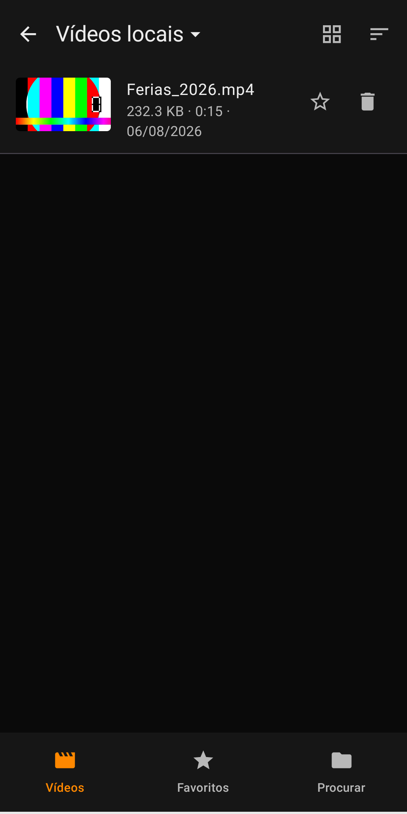
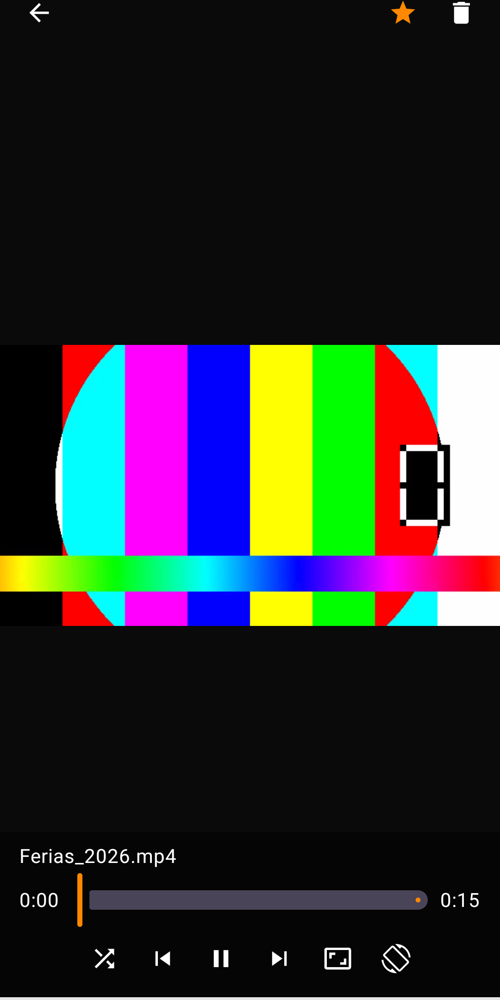
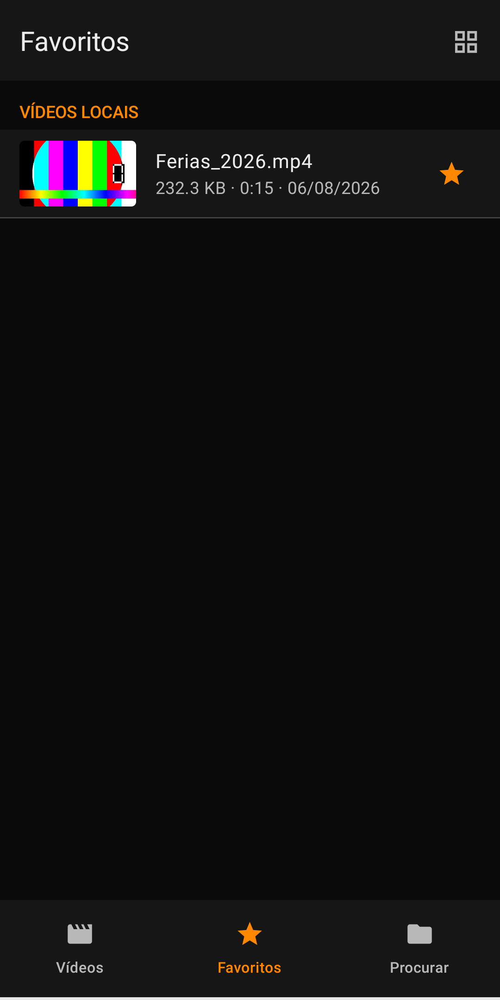
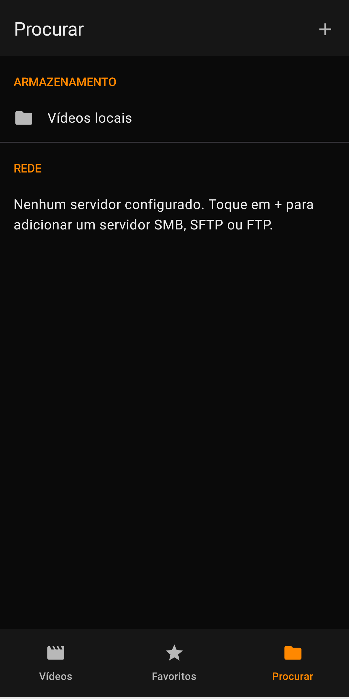

<div align="center">
  

  <p>
    Player de vídeo Android nativo — local, SMB, SFTP e FTP.<br>
    Sem conta, sem anúncios, sem analytics, sem backend próprio.
  </p>
</div>

## Screenshots

<p align="center">
  
  
  
  
</p>

## Sobre

**U.Ai.TAKi Player Vídeo** reproduz os vídeos do seu aparelho e também os que estão guardados em
servidores de rede (SMB, SFTP ou FTP), sem exigir conta, sem anúncios e sem coletar dados de uso.
Cada servidor remoto é configurado uma vez (host, porta, usuário, senha, caminho) e fica salvo
localmente, com a senha criptografada — nada sai do aparelho.

## Funcionalidades

**Fontes de vídeo**
- Armazenamento local do celular (MediaStore)
- Servidores SMB, SFTP e FTP configurados pelo usuário

**Navegação**
- Navegação por pastas e subpastas em todas as fontes
- Miniaturas geradas e cacheadas no aparelho (local e remoto)
- Ordenação por nome, data ou tamanho — lista ou grade

**Player**
- Barra de progresso com tempo decorrido/total
- Duplo toque na lateral: avança/retrocede 10s
- Arraste horizontal: scrub proporcional à posição
- Arraste vertical: brilho (esquerda) e volume (direita)
- Zoom com pinça de dois dedos + arraste para mover a imagem ampliada
- Ajuste de proporção (tamanho original / preencher tela)
- Travamento de orientação (retrato / paisagem / automático)
- Reprodução em ordem aleatória
- Controles somem sozinhos durante a reprodução, reaparecem com um toque
- Tela não escurece durante a reprodução

**Organização**
- Favoritos separados por fonte de origem
- Exclusão de vídeo local (com confirmação) ou remoto (quando a conta tiver permissão de escrita)

**Privacidade**
- Senhas de servidores remotos criptografadas com `EncryptedSharedPreferences` (Android Keystore)
- Nenhum servidor próprio — tudo fica no dispositivo
- Ver [política de privacidade completa](https://leogvital.github.io/uaitaki-playervideo/)

## Stack técnica

- Kotlin + Jetpack Compose (Material 3)
- MVVM: `Composable` → `ViewModel` → repositório de fonte de dados
- [Media3/ExoPlayer](https://developer.android.com/media/media3) para reprodução
- `DataStore` (Preferences) para servidores/favoritos, `EncryptedSharedPreferences` para senhas — sem Room/SQLite, sem backend
- Clientes de rede: [smbj](https://github.com/hierynomus/smbj) (SMB), [sshj](https://github.com/hierynomus/sshj) (SFTP), [Apache Commons Net](https://commons.apache.org/proper/commons-net/) (FTP)

Detalhes de arquitetura e convenções: ver [`CLAUDE.md`](CLAUDE.md).

## Build

```bash
./gradlew assembleDebug     # APK de debug
./gradlew installDebug      # instala num dispositivo/emulador conectado
./gradlew bundleRelease     # Android App Bundle assinado (exige keystore.properties local — ver CLAUDE.md)
```

Requer Android Studio / JDK compatível com o AGP do projeto (ver `gradle/libs.versions.toml`), minSdk 29, targetSdk 36.

## Publicação na Play Store

**Feito:**
- [x] `applicationId` definitivo (`com.uaitaki.playervideo`) e ícone adaptativo
- [x] Chave de assinatura de release gerada e configurada (`./gradlew bundleRelease` já gera o `.aab` assinado)
- [x] Repositório no GitHub (público)
- [x] Ficha da loja: descrição, categoria, screenshots e [gráfico de destaque](store/feature_graphic.png) ([`store/`](store/))
- [x] Política de privacidade publicada: **https://leogvital.github.io/uaitaki-playervideo/**
- [x] Conta de desenvolvedor criada e aprovada no [Google Play Console](https://play.google.com/console/signup)
- [x] Primeira versão enviada para **teste interno**

**Pendente:**
- [ ] Testadores validarem a versão atual sem travamentos/bugs bloqueantes
- [ ] Promover de teste interno para produção (lançamento público)

O passo a passo detalhado de cada item (inclusive backup da chave de assinatura, que é crítico) está em [`CLAUDE.md`](CLAUDE.md#publicação-na-google-play-store).

## Roadmap

**Em andamento**
- [ ] Fase de teste interno na Play Store — corrigir bugs relatados pelos testadores antes do lançamento público

**Backlog do player** (inspirado no menu de opções do VLC para Android, deliberadamente adiado para focar em estabilidade primeiro)
- [ ] Velocidade de reprodução
- [ ] Travar tela (bloquear toques durante a reprodução)
- [ ] Repetição de trecho A-B
- [ ] Modo contínuo (reproduzir sempre a próxima pasta ao terminar a atual)
- [ ] Equalizador

**Robustez de rede**
- [ ] Aviso/nova tentativa automática quando a conexão remota cai no meio da reprodução
- [ ] Gerenciamento de host key (known_hosts) para SFTP — hoje o app aceita a chave de qualquer servidor sem verificação, uma troca deliberada de usabilidade por proteção contra man-in-the-middle
- [ ] Duração exibida para vídeos remotos (hoje não é obtida sem baixar o arquivo)

**Build/infra**
- [ ] Habilitar R8/ProGuard no build de release (reduz tamanho do app) — adiado até testar cuidadosamente contra os três protocolos remotos, que dependem bastante de reflexão

**Depois do lançamento público**
- [ ] Botão de doação (link externo — Pix/PayPal — combinado para só entrar depois do app aprovado e estável em produção; ver `CLAUDE.md`)

### Gerando um build de release local

Requer um `keystore.properties` na raiz do projeto (não versionado — cada máquina/pessoa que assina uma release precisa do seu próprio, com `storePassword`, `keyPassword`, `keyAlias` e `storeFile`):

```bash
./gradlew bundleRelease
# saída: app/build/outputs/bundle/release/app-release.aab
```

## Desenvolvedor

UAiTAKi Soluções Corporativas
